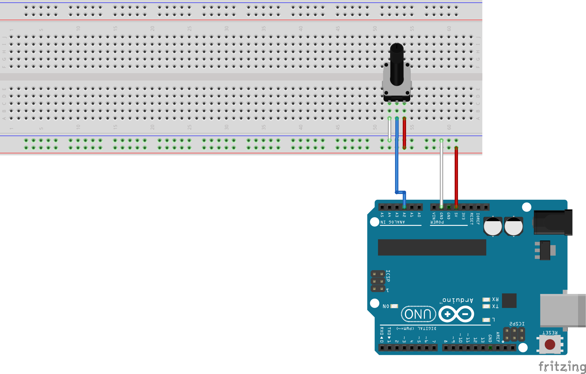
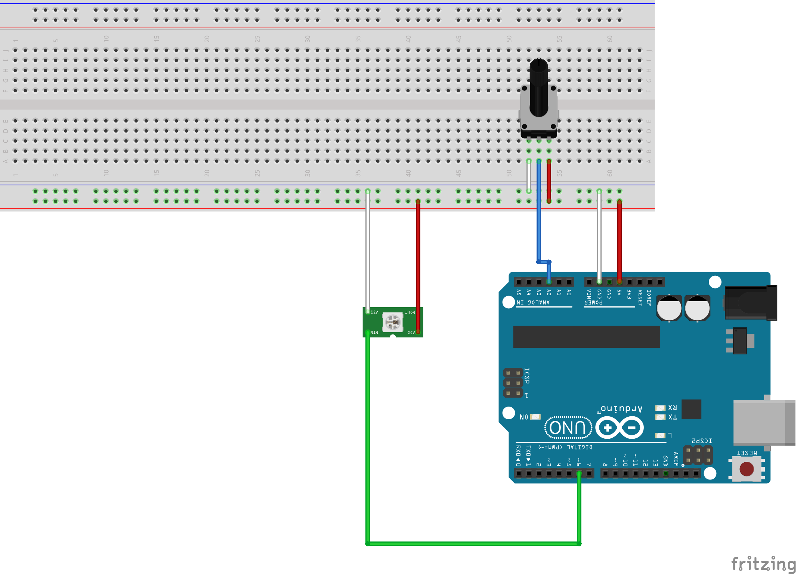
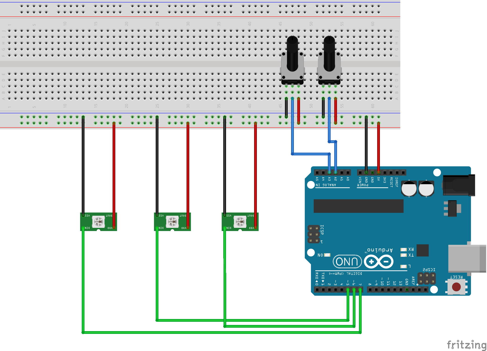

# Prototyp des Bachelorprojektes vink 
von Helene Antonia Lehmann und Isabel Mahnken

Sommersemester 2021, Interactive Media Design, Mediencampus Dieburg der Hochschule Darmstadt

## Umgesetzte Funktionen
In der Umsetzungsphase des Projektes vink hat sich das Team
vorgenommen, das konzipierte Produkt (nähere Informationen sind [hier](https://imd.mediencampus.h-da.de/projekt/vink/) zu finden) teilweise und ansatzweise
in Form eines Prototyps umzusetzen. Ein Prototyp ist hierbei eine
Entwicklungsversion des Endproduktes, die die Kernfunktion des Produktes
erlebbar macht. Gleichzeitig können die konzipierten Funktionen so auf ihre
Umsetzbarkeit überprüft werden. Somit ist ein Prototyp kein vollständig
funktionsfähiges Produkt, sondern eine erste Annäherung an dieses.

### Umsetzung der Eingabe
Ein Teil des Prototyps soll die Eingabefunktion
des Anhängers repräsentieren. Dazu wurde ein
Potentiometer (Vertical RK09K113 von Alps
Alpine) als Sensor mit einem Arduino Uno
folgendermaßen verbunden.




Über die Arduino-IDE wurde ein
Programm ([siehe hier](https://github.com/helede/vink/blob/main/develop/Eingabe/Eingabe.ino)) nach der
im vorangegangenen Kapitel aufgezeigten
Logik geschrieben, das dem über das
Potentiometer eingestellten Wert einem
Farbwert aus dem Farbspektrum zuordnet
und die Ergebnisse auf dem Serial-Monitor
wie folgt anzeigt:


```Eingabewert: 0
Farbe: keine
Farbwert: rgb(0,0,0)
-------------
Eingabewert: 95
Farbe: zwischen gruen und gelb
Farbwert: rgb(229,209,180)
-------------
Eingabewert: 255
Farbe: rot
Farbwert: rgb(255,143,111)>`
```

### Umsetzung der Ausgabe am Eingabeelement
Die umgesetzte Eingabe sollte ebenfalls visualisiert werden. Dazu wurde
zusätzlich eine RGB-LED (WS2812B – RGB-LED) an den Arduino wie
abgebildet angeschlossen. Diese leuchtet in dem errechneten Farbwert der
getätigten Eingabe ([siehe hier](https://github.com/helede/vink/blob/main/develop/EinundAusgabe/EinundAusgabe.ino)).




### Umsetzung der gesamten Ausgabe
Mit der Ausgabe des „Wertedurchschnitts“ soll die ambiente Raumlampe
im Klassenzimmer und deren Funktionen nachgeahmt werden. Damit ein
Durchschnitt aus mehreren Eingaben errechnet werden kann, müssen
mindestens zwei Eingabemöglichkeiten existieren. Aus diesem Grund
wurde die umgesetzte Eingabe um eine RGB-LED (WS2812B – RGB-
LED) und ein Potentiometer (ähnl. Vertical RK09K113 von Alps Alpine)
ergänzt. Dazu wurde noch ein  LED-Stripe (WS2812B – RGB-LED) mit ca. 70 LEDs hinzugefügt. Dazu wurde ein
Programm geschrieben, das den „Wertedurchschnitt“ errechnet und anzeigt. Diese Anzeige wurde zudem animiert, sodass die Wellenbewegung des Lichtspiels annähernd nachgeahmt werden kann ([siehe hier](https://github.com/helede/vink/blob/main/vink/vink.ino)).



## Umgesetzter Prototyp
Die einzeln umgesetzten Funktionen wurden schließlich mithilfe
verschiedener Materialien zu einem Gesamtbild zusammengefügt. Darunter
zählten eine transparente Kunststoffröhre, Holz und Pergamentpapier. Das Ergebnis kann auf
folgendem Video, das über [hier](https://vimeo.com/588472651) zu erreichen ist,
nachvollzogen werden.


